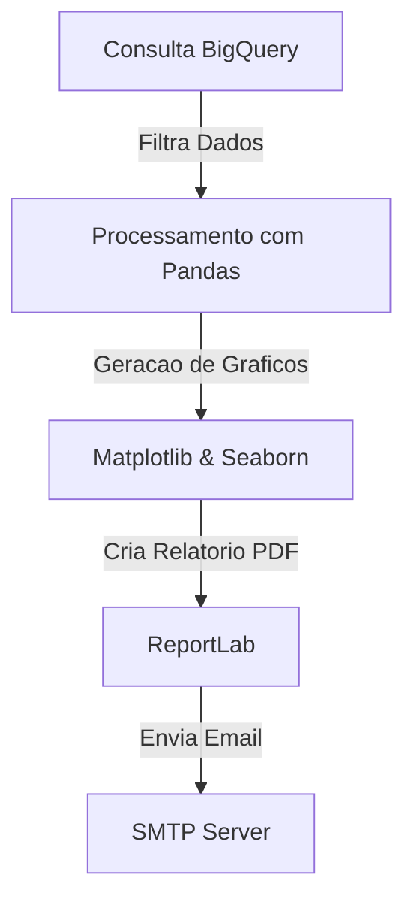

# 🚀 Automacao de Relatorios com Python, SQL e BigQuery

## 📌 Descricao do Projeto

Este projeto foi desenvolvido para **automatizar a geracao de relatorios** no setor de transporte e logistica. Utilizando **Python, SQL e BigQuery**, ele realiza consultas na base de dados, gera visualizacoes, converte os insights em **PDF** e envia automaticamente por e-mail para as partes interessadas.

---

## 🎯 Objetivo

Imagina que um **lider de operacoes** precisa acompanhar o desempenho da frota diariamente. Em vez de acessar o banco de dados manualmente, este projeto executa consultas programadas e entrega os relatorios diretamente na caixa de entrada do e-mail, economizando tempo e evitando erros humanos.

---

## 🛠️ Tecnologias Utilizadas

✅ **Python** - Manipulacao de dados e automacao  
✅ **SQL** - Consultas no BigQuery  
✅ **BigQuery** - Armazenamento e processamento de dados  
✅ **Pandas** - Manipulacao e transformacao de dados  
✅ **Matplotlib & Seaborn** - Geracao de graficos  
✅ **ReportLab** - Criacao de relatorios em PDF  
✅ **SMTP (Email)** - Envio de relatorios automaticamente  

---

🎥 Veja o projeto em ação: [LinkedIn Post](https://www.linkedin.com/posts/victorsabino36_automaaexaetoderelataejrios-anaerlisededados-activity-7304238162300567553-J4ya?utm_source=social_share_send&utm_medium=member_desktop_web&rcm=ACoAAEpQjCAB7CwjLGDgnlDgn5ymhZ3otRWD54c)  

---

## 📊 Fluxo da Automacao



---

## 📂 Estrutura do Projeto

```
📂 automacao_relatorios_Python_SQL 
│   ├── consulta_dados.py
│   ├── gerar_relatorio.py
```

---

## 🔥 Como Executar

1️⃣ Clone o repositório:
```bash
git clone https://github.com/seuusuario/automacao_relatorios_Python_SQL.git
cd automacao_relatorios_Python_SQL
```

2️⃣ Instale as dependências:
```bash
pip install -r requirements.txt
```

3️⃣ Configure as credenciais do BigQuery e do servidor de email.

4️⃣ Execute o script principal:
```bash
python main.py
```

---


## 📢 Contribuicao

Sinta-se livre para contribuir! Caso tenha sugestões ou melhorias, abra um Pull Request ou entre em contato. 🚀

---

